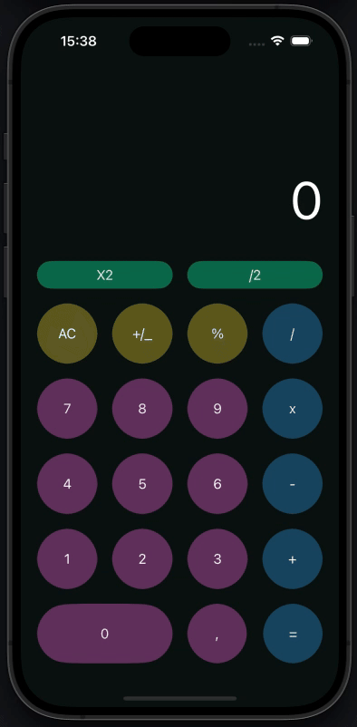

# Calculadora iOS

  
  

##  Descripción

Calculadora iOS es una aplicación que replica la experiencia de una calculadora moderna con una interfaz similar a la de IOS pero con mi propio estilo. Diseñada con Swift y UIKit, ofrece todas las operaciones matemáticas básicas con un diseño limpio y atractivo.

##  Características

- **Operaciones básicas**: suma, resta, multiplicación y división
- **Funciones adicionales**: porcentaje, cambio de signo, multiplicación por 2, división por 2
- **Interfaz adaptativa**: botones redondeados y efectos visuales
- **Soporte para decimales**: con separador adaptado a la configuración regional
- **Memoria persistente**: guarda el último resultado entre sesiones
- **Notación científica**: para números muy grandes

##  Demo

  

##  Tecnologías utilizadas

- Swift 5
- UIKit
- Xcode 16
- Interface Builder con XIB

##  Arquitectura

La aplicación sigue un patrón de arquitectura MVC (Model-View-Controller):

- **Model**: Lógica de cálculo y formateo de números
- **View**: Interfaz de usuario con XIB personalizado
- **Controller**: Manejo de eventos y actualización de la vista

##  Instalación

1. Clona este repositorio
2. Abre `Calculadora.xcodeproj` en Xcode
3. Selecciona un simulador o dispositivo iOS
4. Ejecuta la aplicación (⌘+R)

##  Uso

- Toca los números para introducirlos
- Usa los operadores (+, -, ×, ÷) para realizar operaciones
- Pulsa "=" para obtener el resultado
- "AC" limpia todos los valores, "C" limpia solo el valor actual
- Usa "±" para cambiar el signo del número
- "%" convierte el número a porcentaje
- "×2" multiplica por 2, "÷2" divide por 2

##  Autor

Javier Cardenas Perdomo

Si tienes alguna pregunta o sugerencia, no dudes en contactarme:

- **Email:** cardenas97vga@gmail.com
- **GitHub:** [0re0re0](https://github.com/0re0re0)

##  Licencia

Este proyecto está bajo la Licencia MIT

¡Gracias por visitar mi proyecto!

---
